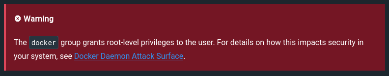
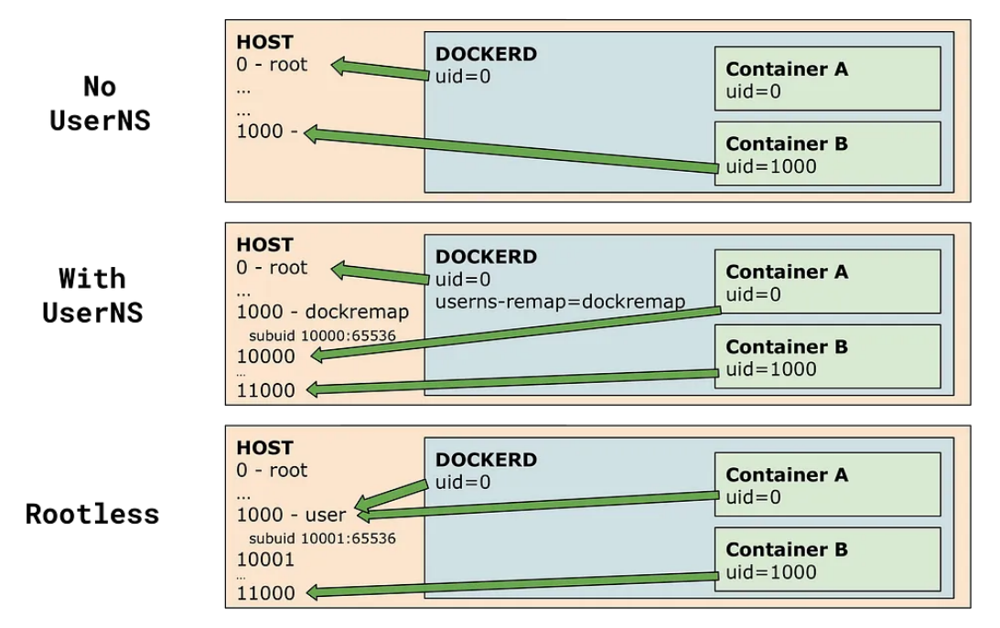

## Bitcoin and Docker - A match (not) made in heaven

**Who should read all of the stuff that follows?**

- Devs who ship their (Bitcoin) software in docker containers
- Users who run this software

**Dude, it's so much, I have no time and why should I care, please...just give me the tl:dr**

> Almost every guide which helps users with setting up containerized Bitcoin software runs Docker in rootfull mode. Devs either don't care or don't realize how their software is run by the majority of users and the implications that come with it. Neither do the users. This is concerning, as it opens up attack vectors by privileg escalation which could lead to a compromise of the whole host machine on which the container is running.
> 
> Devs should check if their shipped containers are able to run in rootless docker mode and if not, fix this asap. Users should start questioning what images they run and how they do it.

---

## Containers, containers everywhere

As I was helping someone setting up a Bitcoin node recently I skimmed through some howto guides and watched some tutorials. Very often they made use of the docker images that the various Bitcoin projects provide.

Don't get me wrong. Docker is great. Everybody loves docker. Devs because it allows them to ship their stuff without worrying too much about the environment of their users. Users on the other hand love docker because they can install complex software, potentially with docker-compose orchestrating multiple containers with just a snip of their fingers. God mode!

The problem I have is that there is a common theme among the guides that goes something like this:

```bash
# Install docker by adding the official docker repo or directly from the repos of their distro
sudo apt-get install docker-ce docker-ce-cli containerd.io docker-buildx-plugin docker-compose-plugin -y

# To not have to type sudo everytime you use the docker command, simply add the user to the docker group
sudo usermod -aG docker yourUserName
```

Most users will do exactly this. Typing `sudo` everytime is a real pain, isn't it?

But have you realized what you (the author of the guide) just made the users do? And did the users notice? Propably not. And yet, with this kind of setup you gave basically everyone who provides docker images to that user full fletched acces to the users machine.

**---> I repeat this: You gave docker image providers FULL access to their host machine <---**

This isn't new or a "vulnerability", it's just the way "normal" docker works. But it was reason enough, that Red Hat made a complete alternative to rootfull Docker (which is called Podman btw). Let that sink in.

### So what's the matter?

Software can contain bugs. Software can be evil. People who write software can have bad intentions. It's important to shield the system against these things and contain the spread of a potential vulnerability. Especially if we run Bitcoin related things, right?

That's the whole freaking point of using containers you might think. My machine here and over there the container. Separated. Peaceful. Total Zen.

But your mental concept is wrong. Your container isn't this isolated thing which lives somehow on your system but doesn't impact its security. At least not if you use Docker in the way mentioned above. Rather, used the wrong way it decrades security and you, as a user, have to put a LOT of trust into the devs to not do any shenanigans with your machine.

Sorry for destroying your worldview. But now that I have your undevided attention let us deep dive into the gist of it.

## Rootfull docker

By adding the user to the docker group you made the user effectifely a root account on the system. You know what a red flag means, don't you? So why did you skip [this box]([Linux post-installation steps for Docker Engine | Docker Docs](https://docs.docker.com/engine/install/linux-postinstall/#manage-docker-as-a-non-root-user)) during installation or writing the howto guide?



This has serious implications as also [stated]([Docker security | Docker Docs](https://docs.docker.com/engine/security/#docker-daemon-attack-surface)) by Docker. Just one issue amongst many:

> This means that you can start a container where the `/host` directory is the `/` directory on your host; and the container can alter your host filesystem without any restriction.

I mean seriously? The container altering my host filesystem without any restrictions? Who would want to run such a crap knowingly on their node?

I can see your reactions right now:

Normal docker container users in disbelieve: "Containers should be secure...they were the chosen ones. Nooooo, you're lying".


In contrast devs be like:


- "Yeah well, a bitcoin node is mostly run by a single person so the user account added to the docker group will be root or in the sudo group anyway, so effectifely no new privileges. Mate, what's the fuss about?".

- "So what, if the user who gets added to the docker group is compromised on the system, the whole set-up isn't secure anymore - nothing to do with docker".

- "We don't do that here, we ain't adding things like the host `/`, so nothing to worry about".

- "In the container we don't run with the root user, we run it with a less privileged one, our users are safu".

- "Don't make so much drama, we're open source, go look at the code. You can verify everything what you run".

### What I would say to all of this

**To the devs:**

You know what? Every argument you made is legit. And users could simply verify. They have the code. They have the docker files. They could check...if they have the time and ability to read your code. But be honest, most of them won't and will rely on trust. Trust in you or trust that others have scrutinized your code for them.

But for me, the basic question is wether this should be an issue at all if there's an easy alternative? Wouldn't it be a positive distinction if you would provide a docker setup which allows running your project in rootless mode by default? Remove the need for any (additional) trust? Give your users some peace of mind?

**To the users:**

Lovely docker users: Where do you pull images from? What things do you download? Do you know what runs if you type `docker-compose up`? Are your scared rn?

I mean it's one thing to run software you haven't checked yourself. But in the best case you do this with a separate, unprivileged user. So the software could be potentially evil but it will stay in the bounds of the user which started it. Not attacking your whole freaking system like it could with docker.

Maybe you should raise some Github issues and ask politely why rootless docker mode isn't supported by your favorite project or guide. Maybe it isn't really an issue and the project supports rootless mode, but the devs don't know or care to elaborate this in their docs? Or maybe just give it a spin yourself, test if the project runs rootless. With the following rootless docker install guide you can try it out. And then contribute back by opening a pull request detailing on how you acchieved to run their project in rootless mode.

**To the howto and tutorial makers:**

I really appreciate you. I can just imagine how many people you onboarded. I mean really onboarded, not like the fake orange-pilling of masses to kyc'ed exchanges. You helped users run code. Good job, really!

But maybe you want to update your guide to rootless docker?


## Rootless docker

#### Install

After Red Hat made rootless Podman as an alternative to rootfull docker, Docker needed to up its game and has provided us with a mode called "Rootless mode/docker". The install is prett [easy]([Run the Docker daemon as a non-root user (Rootless mode) | Docker Docs](https://docs.docker.com/engine/security/rootless/)) but can vary a bit accross distros. Check out the guide!

For an out of the box Ubuntu Server 22.04.3 LTS it consists of the following steps:

On the host system with the admin (`sudo`) account:

- Install utilities for managing subusers and networking - if needed also standard docker compose (and only docker compose, not the rest of docker)
  
  ```bash
  sudo apt install uidmap dbus-user-session slirp4netns docker-compose-plugin
  ```

- Add a unprivileged user and switch to it
  
  ```bash
  sudo useradd --disable-login --gecos "" rootlessdockeruser
  sudo su - rootlessdockeruser
  ```

- Install rootless docker (note - no sudo required)
  
  ```bash
  curl -fsSL https://get.docker.com/rootless | sh
  ```

- Copy environment variables **as stated in the end of the install script** to users `.bashrc`
  
  ```bash
  nano ~/.basrc
  # Add following lines, take the id of your user 
  # (run command "id"" and take value of uid=userid 
  # if you cleard the terminal without copying)
  export PATH=/home/rootlessdockeruser/bin:$PATH
  export DOCKER_HOST=unix:///run/user/<<<<userid>>>>/docker.sock
  ```

- Go back to your admin user and let the `rootlessdockeruser` run long running tasks even if not logged in:
  
  ```bash
  exit
  # back in the admin account
  sudo loginctl enable-linger rootlessdockeruser
  ```

- Go back to unprivileged docker user
  
  ```bash
  sudo su - rootlessdockeruser
  ```

- Test install (note - no root requried and everything runs with an unprivileged user: docker daemon and docker client)
  
  ```bash
  docker run hello-world
  ```

BOOM - done.

#### How it works

Software is complex. If you want an in-depth explanation search the web.

What you should know rn is that with the above setup you have a rootless docker daemon and client installed for your user and nobody who provides you with container images or mounts volumes or what not can escape the permissons you gave `rootlesdockeruser`. Nobody can alter your host filesystem without any restrictions anymore. At least not as long as there isn't a bug in the linux kernel but hey, then we have some other problems. In the end that's how docker should be and you imagined it to be in the first place!

**How you might ask?**

Containers are in reality namespaces. And as such a namsepace in your container can be mapped to the namespace of the host. That's bad if root in the container is the same as root outside of the container (i.e. the host). This [medium post](https://medium.com/@mccode/understanding-how-uid-and-gid-work-in-docker-containers-c37a01d01cf) explains this pretty well.

Containers started by rootless docker use the [namespace]([Isolate containers with a user namespace | Docker Docs](https://docs.docker.com/engine/security/userns-remap/)) of the <u>user</u> in which docker is run. Think of child users of the unprivileged user you created:

```bash
id -u
1001
whoami
testuser
grep ^$(whoami): /etc/subuid
testuser:231072:65536
```

So `testuser` can create 65.536 new "sub"-users with id's from 231.072 upwards.

A more graphical way of explaining this can be found [here:](https://medium.com/@tonistiigi/experimenting-with-rootless-docker-416c9ad8c0d6)



What this means is, that `root` in the container is root-like only for all things related to the container (you could destroy your container or add new users).

But the important part: this doesn't apply to the host! For the host each and every user in the container, even its `root` user, is just `rootlessdockeruser` or one of its subusers, with all of the limitations applied to `rootlessdockeruser`.

A more technical walkthrough can be found in [Overview of Rootless Podman: Part 1 - Understanding Root Inside and Outside a Container]([Overview of Rootless Podman: Part 1 - Understanding Root Inside and Outside a Container - YouTube](https://www.youtube.com/watch?v=ZgXpWKgQclc)[Overview of Rootless Podman: Part 1 - Understanding Root Inside and Outside a Container - YouTube](https://www.youtube.com/watch?v=ZgXpWKgQclc)) and [Overview of Rootless Podman: Part 2 - How User Namespaces Work in Rootless Containers]([Overview of Rootless Podman: Part 2 - How User Namespaces Work in Rootless Containers - YouTube](https://www.youtube.com/watch?v=Ac2boGEz2ww)). Although it's for Podman it works the same for docker. Go watch the videos!

#### Working with rootless mode

There are limitations of course. Not really from the docker side. I can't imagine that your projects are so complicated that rootless docker shouldn't be able to handle it.

> This means that in most cases, containers do not need "real" root privileges *at all*.

If the [docker guys]([Docker security | Docker Docs](https://docs.docker.com/engine/security/#linux-kernel-capabilities)) say this but your project needs real root access maybe you're doing something wrong?

Right now I see 3 pain points for adoption which must be properly managed by developers or should be investigated first by users in the case that containers don't seem to run in rootless mode:

1. Does the project bind to priviledged ports (<1024) of the host.
   
   That should be easy. HTTP doesn't need to be on port 80. Just choose some of the other 64.511 ports available. Make it easy to customize. Make it discovaerable. Users should search in the Dockerfile oder docker-compose file.

2. Be carefull when mounting volumes
   
   Files and folders on the host system are created by the unprivileged user, `rootlessdockeruser` in the example above. If the container is started with a different user, it could be that the owner of the host file/folder is differend from the user who tries to access the file/folder from within the container. Proper user and permisson mangagment must be applied so that no "I don't have access to that file" suprises appear. This issue is compounded by the additional user namespace that comes with rootless docker.

3. Networking
   
   The first time I tried a rootless docker install I neglected to install the `slirp4netns` package. The docker containers worked but I kept getting networking issues. Docker falls back to `vpnkit` without the package installed. Once I DID installe it everything worked.
   
   I tell you this because networking without root can be tricky. Up until now I haven't run in another issue though. But be mindfull.

#### Disadvantages

As far as I can see there isn't a system wide install. For every project you will need to create a new unpriviledged user and follow the steps above to install rootless docker. That can equate to a lot of users and switching between them.

You could create a low number of unpriviledged `docker` users instead of a dedicated user for every project. This conveniance comes with the price tag of a lower security though (but in no way comparable to a rootfull docker).


## The Future

Maybe I'll continue with some setups of rootless docker containers. I don't know. Maybe someone else also wants to contribute. Maybe you'll send the above lines to someone. 

Either way, now that YOU have read all of this you know that your docker setup wasn't and probably still isn't secure. So go do something about it...